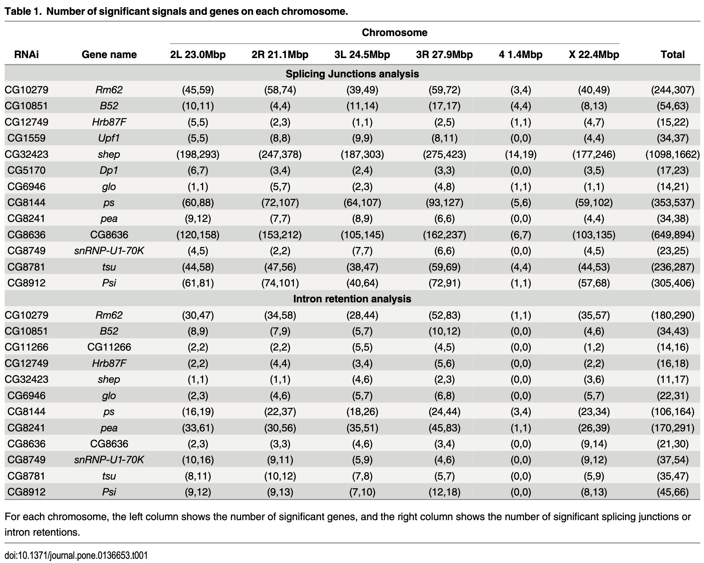

# Comparative Analysis of Alternative Splicing across Human Tissues Using GTEx RNA-Seq
## Description
Alternative splicing during mRNA maturation is essential for major biological processes in eukaryotes such as cellular differentiation and proper gene regulation. Here, using RNA-Seq data from the Genotype-Tissue Expression (GTEx) Consortium, we aim to characterize differential alternative splicing events - including splice junctions (SJs) and intron retentions (IRs) - across tissues with the help of DEXSeq. By doing so, we hope to eventually gain a deeper understanding of how cell fate in different tissues is dictated by alternative splicing.  
## Example published figure
  
  
  
## Datasets
[The GTEx Analysis V10 RNA-Seq](https://www.gtexportal.org/home/downloads/adult-gtex/bulk_tissue_expression#bulk_tissue_expression-gtex_analysis_v10-rna-seq)   
[*Drosophila* RNA Binding Protein RNAi RNA-Seq Studies GSE18508](https://www.ncbi.nlm.nih.gov/geo/query/acc.cgi?acc=GSE18508)
## Software  
Python  
R  
## R Packages  
[DEXseq](https://bioconductor.org/packages/release/bioc/html/DEXSeq.html)  
[pasilla](https://bioconductor.org/packages/3.21/data/experiment/html/pasilla.html) 
## Proposed goals
1. Processing GSE18508 RNA-seq data using DEXSeq to familiarize ourselves with the software and try to reproduce the example figure and table.
2. Extending the pipeline to GTEx RNA-Seq data, focusing on crucial genes.
3. Comparing DEXSeq with other alternative splicing analysis softwares.
## References
1. Li Y, Rao X, Mattox WW, Amos CI, Liu B (2015) RNA-Seq Analysis of Differential Splice Junction Usage and Intron Retentions by DEXSeq. *PLOS ONE* 10(9): e0136653. https://doi.org/10.1371/journal.pone.0136653
2. Anders S, Reyes A, Huber W. Detecting differential usage of exons from RNA-seq data. *Genome research*. 2012; 22(10):2008–17. doi: 10.1101/gr.133744.111 PMID: 22722343; PubMed Central PMCID: PMC3460195.
## Slides
https://docs.google.com/presentation/d/1UDEf2NieTSC4jmAXDyfvduWXt9NuG4X8/edit?slide=id.p1#slide=id.p1
