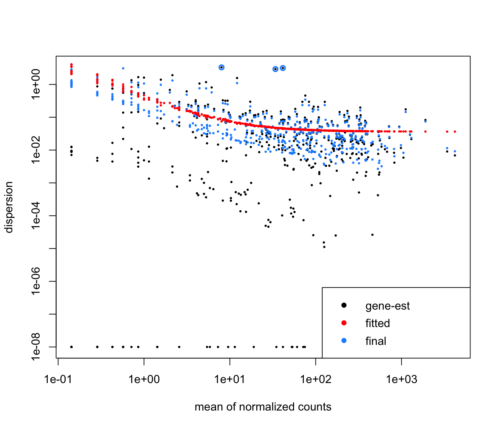

# Check-in 1
Initially we tried to use LeafCutter as our main software, but due to compatibility issues it cannot be installed successfully on MacOS. We also attempted the installation on Windows but to no avail. Therefore, we switched to DEXSeq, an R package that focuses on exon counts. We next found a paper that performs differential analysis of splice junctions and intron retentions using DEXSeq on RNA-seq data from *Drosophila*. We aim to replicate the tables and figure from the paper as our initial step. 
## Addressing Feedback  
The published figure and tables are now displayed normally in README.md. 
## Progress
  
  
We downloaded DEXSeq and the raw data and examined the documentation for DEXSeq, whose input requires sequence alignment and annotation. We also found the published code from the paper and tried to follow the pipeline.

## Project Organization
      ...  
      |-- README.md    <-- title, description, overview figure  
      |-- data/        <-- only small (<1 Mb), instructions on retrieving larger  
      |-- doc/         <-- reports, slidedecks  
      |-- results/     <-- only small (<1 Mb), instructions on retrieving larger  
      |-- src/         <-- code  
      ...
## Struggle
1. Handling the raw data is very time consuming given its large file size.  
2. Data preparation for DEXSeq requires alignment, annotation, and counting reads which is hard to follow from the published code.

Therefore, working with the given dataset by following the pipeline would take a lot of time. We hope to get advice on how to streamline the process and if our goal is feasible.
